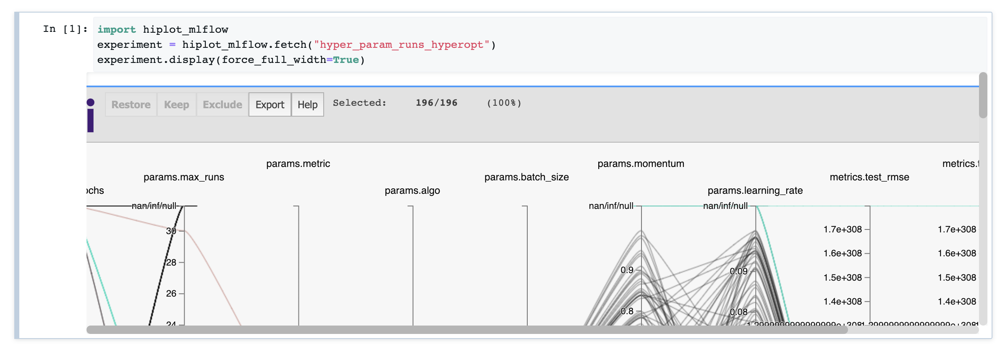

# hiplot-mlflow

A  [HiPlot](https://facebookresearch.github.io/hiplot/index.html) experiment fetcher plugin
for [MLflow](https://mlflow.org/), to help visualise your tracked experiments.

## Installation

Install this library with `pip` as:

```Shell
pip install hiplot_mlflow
```

## Usage

You can visualise experiments either in a Jupyter notebook or using HiPlot's built in server.

### Notebook

In a Jupyter notebook, use `hiplot_mlflow.fetch` to retrieve an MLflow
experiment by name, and display it with HiPlot:

```Python
import hiplot_mlflow
experiments = hiplot_mlflow.fetch("my-lovely-experiment")
experiments.display(force_full_width=True)
```

You can also retrieve experiments by their MLflow experiment ID:

```Python
experiment = hiplot_mlflow.fetch_by_id(0)
```

By default, MLflow tags are not shown (only MLflow metrics and parameters are
shown). To display them, pass `include_tag=True` to either of the fetch
functions, for example:

```Python
experiment = hiplot_mlflow.fetch("my-lovely-experiment", include_tags=True)
```



See more about what you can do with the returned `hiplot.Experiment` values in the
[HiPlot documentation](https://facebookresearch.github.io/hiplot/experiment_settings.html).

### HiPlot Server

To use [HiPlot's built in webserver](https://facebookresearch.github.io/hiplot/tuto_webserver.html)
with `hiplot-mlflow`, you can start it up with the custom
[experiment fetcher](https://facebookresearch.github.io/hiplot/tuto_webserver.html#experiments-uri)
implemented by this package:

```Shell
hiplot hiplot_mlflow.fetch_by_uri
```

You can then use the `mlflow://` schema to access MLflow experiments in HiPlot
by either experiment or name, for example:

```text
mlflow://name/experiment-name
mlflow://id/0
```


You can also add `tags=yes` as a query string parameter to include tags in the
output, for example:

```text
mlflow://name/experiment-name?tags=yes
```

You can also use the [multiple experiments](https://facebookresearch.github.io/hiplot/tuto_webserver.html#compare-multiple-experiments)
loading syntax. Either the dictionary format (to define your own labels):

```text
multi://{
    "first-experiment": "mlflow://id/1",
    "another-experiment": "mlflow://name/another-experiment?tags=yes"
}
```

or list format:

```text
multi://[
    "mlflow://id/1",
    "mlflow://name/another-experiment?tags=yes"
]
```


